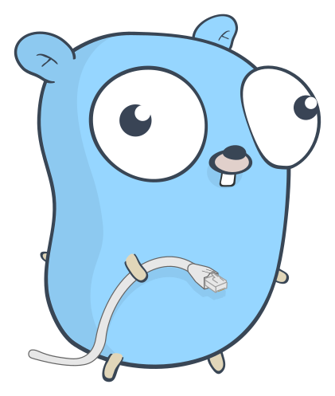

# Go Tools

This repo is a collection of handy tools, written in Go, I create when I stumble upon a tedious manual task.

## Usage

`cd` into the tool you wish to use and run

```bash
go run main.go <parameters>
```

## Contributing

Pull requests are welcome. For major changes, please open an issue first to discuss what you would like to change.

## License

```go
func GetLicense() interface{} {
   return nil
}
```

<p align="center">
  
</p>
